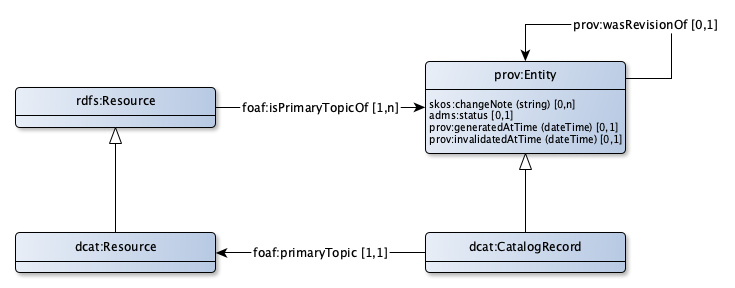
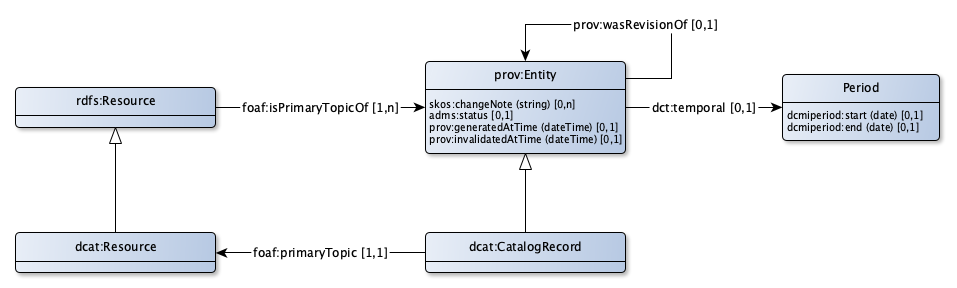

# History, versioning and provenance

## Base provenance model
A catalog typically makes the distinction between different versions of catalog records within the catalog. This makes it possible to track at which time a specific version of a catalog record is created or updated and which person was responsible for the particular change.

The basis for the history model is the distinction between a catalog record and the topic of that particular catalog record, as depicted in the diagram below.



The class *dcat:CatalogRecord* is specific to the DCAT vocabulary, in the generic Catalog profile, we will use the more general *prov:Entity* for any record that is the primary topic of a resource in our catalog. In the same manner, we use the class *rdfs:Resource* as the more generic class of *dcat:Resource*.

## Lifecycle management: status
Catalog records go through different stages during their lifecycle. Four separate stages are supported, from the ADMS vocabulary:

- adms:UnderDevelopment
- adms:Completed
- adms:Deprecated
- adms:Withdrawn

All new catalog records have by default the status `adms:UnderDevelopment`. This means that the particular catalog record is considered *under development* and not yet available for general public.

To publish a catalog record, the status can be changed to `adms:Completed`. This means that the particular catalog record is considered *completed* and available for general public.

To mark a catalog record for deletion after it was completed (or otherwise mark the catalog record as not to be used any more), the status can be changed to `adms:Deprecated`. This means that the particular catalog record is considered *deprecated* and, although available for general public, should not be used any more.

A catalog record that is deleted or updated after it was completed is considered *withdrawn* and gets the status `adms:Withdrawn`. Other records retain the status `adms:UnderDevelopment`.

## System History

### Specification
System history deals with the creation and deletion of catalog records in the catalog storage system. We only consider creation and deletion. "Changing" a catalog record actually indicates the creation of a new catalog record and might result in the deletion of the old catalog record.

The creation of a new catalog record results in a `prov:generatedAtTime` statement with as a value the date and time of creation.

The deletion of an existing catalog record results in a `prov:invalidatedAtTime` statement with as a value the date and time of deletion.

An update of an existing catalog record results in the creation of a new catalog record, with a `prov:wasRevisionOf` statement, relating the new catalog record with the existing catalog record. A `prov:generatedAtTime` statement is also added to the newly created catalog record.

**ONLY** in the situation of a simple system history model, a `prov:invalidatedAtTime` statement is added to the old catalog record. The values for generatedAtTime and invalidatedAtTime should be exactly the same.

### API for the simple history model

#### Creating a resource
Creating "Some concept", a `skos:Concept`.

```
http POST http://catalog.org/api/v1/concepts

http://catalog.org/id/concept/some-concept a skos:Concept;
  rdfs:label "Some concept"@en;
.
http://catalog.org/doc/2019-01-01T12:15/some-concept a prov:Entity;
  prov:generatedAtTime "2019-01-01T12:15"^^xsd:dateTime;
  adms:status admsstatus:UnderDevelopment;
  prov:isPrimaryTopicOf <http://catalog.org/id/concept/some-concept>
.
```

#### Updating an existing resource
Change the name and adding a comment. An existing resource is considered to be changed "as a whole": all statements are send, even those that are not changed.

```
PUT http://catalog.org/id/concept/some-concept

http://catalog.org/id/concept/some-concept a skos:Concept;
  rdfs:label "Some concept.."@en;
  rdfs:comment "A comment about some concept"@en;
.
http://catalog.org/doc/2019-04-02T18:43/some-concept a prov:Entity;
  prov:generatedAtTime "2019-04-02T18:43"^^xsd:dateTime;
  adms:status admsstatus:UnderDevelopment;
  prov:isPrimaryTopicOf <http://catalog.org/id/concept/some-concept>;
  prov:wasRevisionOf <http://catalog.org/doc/2019-01-01T12:15/some-concept>
.
http://catalog.org/doc/2019-01-01T12:15/some-concept
  prov:invalidatedAtTime "2019-04-02T18:43"^^xsd:dateTime;
.
```

It should be possible to update a record that is already deleted. In such a case, the prov:invalidatedAtTime statement is not changed and retains the date time of deletion. It should **NOT** be possible to recreate a deleted resource with a POST operation.

#### Deleting a resource
Deleting of "Some concept".

```
http DELETE http://catalog.org/id/concept/some-concept

http://catalog.org/doc/2019-04-02T18:43/some-concept
  prov:invalidatedAtTime "2019-05-03T07:35"^^xsd:dateTime;
.
```

#### Publishing a resource

We want to publish the most recent catalog record.

```
http POST http://catalog.org/api/v1/publish?subject=http://catalog.org/id/concept/some-concept

http://catalog.org/doc/2019-04-02T18:43/some-concept
  adms:status admstatus:Completed;
.
```

## Valid History

A more complex history model can be obtained by adding "data validity" to a system history model. Validity is always about the catalog record itself: at what point in time was the catalog record considered "valid".

By adding a `dct:temporal` statement to the catalog record, we can state at which point in time the catalog record was valid and at which time the catalog record wasn't valid any more.



### API for a simple validity history model

#### Mark as valid
Making the most recent catalog record valid from januari first, 2019. Mark that this action is performed in april. This is quite common. The reverse can also occur.

```
http POST http://catalog.org/api/v1/markvalid?subject=http://catalog.org/id/concept/some-concept

http://catalog.org/doc/2019-04-02T18:43/some-concept
  adms:status admstatus:Completed;
  dct:temporal [
    dcmiperiod:start "2019-01-01"^^xsd:date;
  ]
.
```

No new catalog record is created, the most recent is used. The status of the catalog record is automatically set to `adms:Completed`.

Only one catalog record can be valid at a point in time. When a new catalog record is marked as valid, the validity of the other catalog record is ended:

```
http POST http://catalog.org/api/v1/markvalid?subject=http://catalog.org/id/concept/some-concept

http://catalog.org/doc/2019-01-01T12:15/some-concept
  dct:temporal [
    dcmiperiod:start "2018-12-01"^^xsd:date;
    dcmiperiod:end "2019-01-01"^^xsd:date;
  ]
.
http://catalog.org/doc/2019-04-02T18:43/some-concept
  adms:status admstatus:Completed;
  dct:temporal [
    dcmiperiod:start "2019-01-01"^^xsd:date;
  ]
.
```
